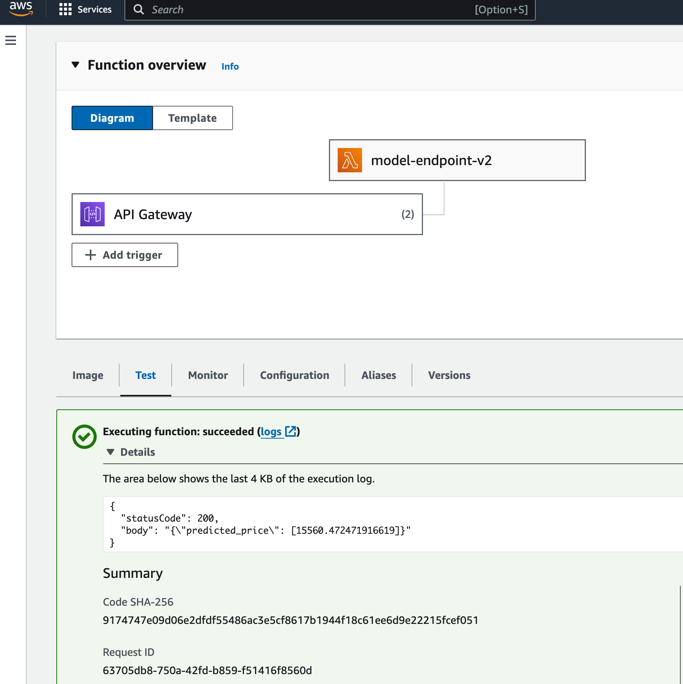

# **Car Price Prediction - MLOps on AWS**

This repository contains the resources and source code for a machine learning assignment aimed at predicting car prices. The project leverages AWS services, including Lambda and API Gateway, and follows MLOps practices to automate and monitor all steps of machine learning system construction.

## **Repository Structure**

```bash
├── README.md
├── data
│   └── dataset.npz              # Raw and preprocessed data
├── images
│   └── kde.png                  # Images used in README documentation
├── lambda-ct-pipeline
│   └── ct_lambda_function.py    # Lambda function for continuous training pipeline
├── lambda-model-endpoint
│   ├── Dockerfile               # Dockerfile for building Lambda deployment image
│   ├── main.py                  # Main script for Lambda function initialization
│   └── model_endpoint_lambda_function.py  # Lambda function for model predictions
├── model
│   ├── finalized_linear_model.pkl  # Saved final linear model
│   ├── label_encoder.pkl           # Label encoder for categorical data preprocessing
│   ├── model.py                    # Script for model training and evaluation
│   ├── onehot_encoder.pkl          # One-hot encoder for categorical data preprocessing
│   ├── scaler.pkl                  # Scaler object for numerical data normalization
│   └── train.csv                   # Training dataset
└── notebooks
    └── development-notebook.ipynb  # Jupyter notebooks on Model Preparation for Deployment including EDA, data visualization, data preprocessing, and model code refinements

```

### **Directories and Files**

- **`/notebooks`**: Jupyter notebooks on Model Preparation for Deployment including EDA, data visualization, data preprocessing, and model code refinements.
- **`/model`**: Contains all trained machine learning models and their corresponding encoders, along with the training dataset.
    - **`finalized_linear_model.pkl`**: The serialized final linear regression model ready for predictions.
    - **`label_encoder.pkl`**, **`onehot_encoder.pkl`**, **`scaler.pkl`**: Serialization of preprocessing encoders.
    - **`model.py`**: Initial model training python code provided.
- **`/lambda-model-endpoint`**:
   - **`Dockerfile`**: Defines the Docker container used to deploy the Lambda function.
   - **`test.py`**: Unit test for the model endpoint Lambda function.
   - **`model_endpoint_lambda_function.py`**: Implements the Lambda function to serve the model predictions.
- **`/lambda-ct-pipeline`**: Holds the AWS Lambda function for continuous training of the machine learning model.
- **`/data`**: Contains raw and preprocessed datasets used in model training.
- **`/images`**: Includes images used within the README documentation to explain concepts or results.


## Local Development Setup


For this assignment, I set up the local development environment on a Mac M1 Pro using Miniconda. I carefully followed specific steps to ensure seamless reproducibility and maintainability. This approach guaranteed that all necessary Python packages and Jupyter functionalities were readily available:

1. **Create a Conda Environment**:

    ```bash
    conda create --name car-price-pred-mlops python
    ```

   This command creates a new Conda environment named **`car-price-pred-mlops`**. It's isolated from other environments, ensuring that package dependencies do not interfere with those in different projects.

2. **Activate the Environment**:

    ```bash
    conda activate car-price-pred-mlops
    ```

   Activating the environment makes it the current working environment, which means all Python and command-line operations take place within this environment.

3. **Install Jupyter Notebook**:

    ```bash
    conda install jupyter
    ```

   Jupyter Notebook is installed in the environment, which is a powerful tool for interactive coding and visualization, often used in data science and machine learning projects.

4. **Install IPython Kernel**:

    ```bash
    conda install ipykernel
    ```

   This command installs the IPython kernel, which allows Jupyter to run Python code. The kernel acts as the backend that processes the code written in the notebook.

5. **Set up IPython Kernel for the Environment**:

    ```bash
    python -m ipykernel install --user --name car-price-pred-mlops --display-name "Car Price Prediction MLOps"
    ```

   This step registers the newly created Conda environment in Jupyter under the name "Car Price Prediction MLOps". It allows the environment to be selected as the kernel in Jupyter notebooks, ensuring that notebooks use the specific environment's settings and installed packages.

6. **Launch Jupyter Notebook**:

    ```bash
    jupyter notebook
    ```

   This command starts the Jupyter Notebook server locally in web browser, from where we can create and manage your notebooks.

### **Additional Requirements**

1. **Docker Installation**:
    - Docker is installed to handle containerization, necessary for deploying functions and services.
    - Visit Docker's official site for installation instructions.
2. **AWS CLI Installation**:
    - The AWS Command Line Interface (CLI) is installed to interact with AWS services directly from the terminal.
    - Detailed installation guides are available on the [AWS documentation page](https://aws.amazon.com/cli/).
3. **AWS CLI Configuration**:
    - AWS CLI is configured with user credentials to authenticate and interact with AWS resources.
    - Run **`aws configure`** to set up AWS access key ID, secret access key, region, and output format.
4. **Python Libraries Installation**:
    - Essential Python libraries are required for data handling, statistical analysis, and machine learning operations.
    - To install these libraries, use the **`requirements.txt`** file provided in the repository.

        ```bash
        pip install -r requirements.txt
        ```

# **Step 1: Model Preparation for Deployment**
I initiated the project by performing extensive exploratory data analysis and data visualization. This critical first step allowed me to refine the provided Python scripts and prepare the linear regression model for deployment on AWS Lambda. This analysis helped me gain a complete understanding of the dataset and identify the necessary data preprocessing steps to enhance model performance.

After completing the analysis, I implemented further data preprocessing tasks, such as normalization and encoding. I then moved on to train and evaluate the linear regression model. Once the training was complete, I serialized both the model and the encoders and uploaded them to AWS S3. This step ensures seamless integration and execution within the Lambda function.

**`Notebook Reference and Location: For a detailed look at the code, documentation, and step-by-step execution outputs, please refer to the Jupyter notebook located at /notebooks/development-notebook.ipynb.`**

## **Exploratory Data Analysis (EDA)**

In this phase, I performed Exploratory Data Analysis (EDA) on the Car Price Prediction dataset using a suite of standard templates that I have developed. 
This practice is standard whenever I approach a data science problem. 
The initial investigation and cleaning process are crucial for refining the provided Python script. 
This involves adding the necessary preprocessing steps required for creating an accurate predictive model. 
The goal of this phase is to prepare a clean and well-understood dataset, ensuring that it is ready for subsequent feature engineering and model development steps.

### EDA Objectives
The following key tasks are executed to achieve a comprehensive understanding and preparation of the dataset:

- **List of Columns**: Identify all columns in the dataset to understand the features available.
- **Dataset Shape**: Determine the size of the dataset to understand the scope of data.
- **Data Types**: Ascertain the data types of each column to identify any necessary conversions.
- **Unique Values**: List all unique values in each column to detect any anomalies or irregularities.
- **Convert Data Types**: Adjust the data types of specific columns as necessary for proper analysis.
- **Handling Missing Values**: Identify and address any missing data in the dataset.
- **Summary Statistics**: Generate summary statistics of numeric columns to gain insights into the distribution and central tendencies of the data.

### Insights for EDA

**Categorical Variables**

In the given dataset, the following variables are considered categorical as these variables are used to group data into categories where each category is distinct and has no inherent numerical relationship with the others.

- **Fuel_Type**: Includes categories like 'Diesel', 'Petrol', and 'CNG'. Used as categorical due to distinct fuel types influencing car performance and pricing.
- **Doors**: Represents the number of doors (2, 3, 4, 5) and is treated as categorical to differentiate car body styles.
- **Automatic**: Binary variable (0 for manual, 1 for automatic), distinguishing between transmission types.
- **MetallicCol**: Binary variable (0 for non-metallic, 1 for metallic), indicating the presence of a metallic paint finish.


**Numerical Variables:**

Below variables can be identified as numerical variable as they provide quantitative measures that are essential for calculations and model estimations in machine learning.

- **Kilometers**: A continuous variable showing the car's mileage, which directly influences car value and usage characteristics.
- **HorsePower**: Measures the engine power in horsepower, a continuous quantity impacting car performance.
- **CC**: Engine capacity in cubic centimeters, treated as numerical to quantify engine size.
- **Wt** (Weight): The weight of the car in kilograms, a continuous numerical measure relevant to vehicle dynamics and efficiency.
- **SellingPrice**: Often the target variable, representing the price at which the car is sold, treated as a continuous numerical variable.
- **Age**: Represents the age of the car in years. Although it could be ordinal, it is treated as numerical due to its direct quantitative impact on the car's value and condition.


## Data Visualization

Data visualization is a crucial phase in data analysis for identifying patterns, relationships, and gathering insights that may not be apparent from raw data alone. Effective visualizations can illuminate trends and provide a clearer understanding of the data set's dynamics, particularly in relation to car price. To comprehensively explore the data, various visualization techniques are employed, each serving distinct purposes in the analysis:

- **Kernel Density Estimate (KDE) Plots**: Useful for understanding the distribution of numerical data.
- **Q-Q Plots**: Help assess if a dataset is distributed a certain way, typically gaussian.
- **Histograms**: Ideal for visualizing the distribution of data and observing the shape.
- **Boxplots**: Provide a graphical representation of the numerical data through their quartiles and are especially useful for detecting outliers.
- **Scatter Plots**: Highlight correlations or dependencies between two variables.
- **Heatmaps**: Useful for visualizing the correlation matrix of variables.
- **Count Plots**: Excellent for visualizing categorical data distributions.


### Plotting Detailed Visualizations
To further analyze and visualize the data, specific Python code leveraging `matplotlib` and `seaborn` libraries is employed. The code snippets enhance the aesthetics and provide detailed insight for each numerical column in the dataset.

### Insights Derived from KDE Plots


Initial observations from Kernel Density Estimate (KDE) plots include:
1. **Kilometers**: The KDE plot for Kilometres shows a right-skewed distribution, indicating that most of the cars have lower mileage, with few cars having high mileage.
2. **HorsePower**: The HorsePower distribution is multi-modal with specific peaks, suggesting clusters around common horsepower ratings for cars.
3. **CC (Engine Size)**: The distribution shows multiple peaks, which may indicate common engine sizes. It is right-skewed, suggesting smaller engine sizes are more prevalent.
4. **WT (Weight)**: The weight distribution appears normally distributed with a single peak, indicating most cars have a weight around this central value.
5. **SellingPrice**: The SellingPrice is right-skewed, suggesting that most cars are clustered around a lower price range with fewer high-priced cars.
6. **Age**: The car age distribution is also right-skewed, indicating that there are more newer cars and fewer older cars.

## Data Preprocessing

### Normalization
To handle potential scale discrepancies among these numerical features, we use the MinMaxScaler from scikit-learn. This scaler transforms each feature to a range between 0 and 1, maintaining the distribution but aligning the scales. This is crucial as it prevents attributes with larger ranges from dominating those with smaller ranges, which is important for many machine learning algorithms.

### **Label Encoding**

For the **`Doors`** feature, which is ordinal, we apply label encoding. This approach converts the categorical labels into a single integer column, preserving the order, which is appropriate for ordinal data.

### **One-Hot Encoding**

The **`Fuel_Type`** feature is treated with one-hot encoding, which is essential for nominal categorical data. This method transforms each categorical value into a new binary column, ensuring that the model interprets these attributes correctly without any implicit ordering.

### **Feature Transformation**

After encoding, we handle the transformation from sparse to dense formats. Many machine learning algorithms require a dense matrix format, so we convert the sparse matrix obtained from one-hot encoding into a dense format. This is performed using the **`.toarray()`** method, which is necessary to integrate these features into the main DataFrame seamlessly.

### **Integration with Original DataFrame**

The newly created dense matrix columns are named according to the unique values in **`Fuel_Type`** and then concatenated back to the original DataFrame. Columns derived from **`Fuel_Type`** are added, and the original **`Fuel_Type`** column is dropped to avoid redundancy.

### **Final Adjustments**

For binary categorical features like **`Automatic`** and **`MetallicCol`**, which are already in a binary format, we explicitly cast them to a 'category' type to ensure consistency in data types across the DataFrame. This step is important for some types of statistical analysis and modeling in Python.

### **Training Data Preparing**

This code performs the following operations:

- [ ] Splits the data into feature (**`X`**) and label (**`y`**) arrays.
- [ ] Uses **`train_test_split`** twice to create a train set (60% of the data), a validation set (20%), and a test set (20%).
- [ ] Saves the training, validation, and test sets to an **`.npz`** file, which can then be loaded for training.
### **Model Training**

Improvement have done to the provided linear regression model is codes for training and evaluating the model. The model is trained on the training set and evaluated on the validation set.

### **Model Evaluation**

To evaluate the performance of the trained model, the following metrics are calculated using the validation set:

- **Mean Squared Error (MSE)**: Represents the average of the squares of the errors—i.e., the average squared difference between the estimated values and the actual value.
- **R-Squared (R²)**: Provides an indication of goodness of fit and therefore a measure of how well unseen samples are likely to be predicted by the model.
- **Mean Absolute Error (MAE)**: Measures the average magnitude of the errors in a set of predictions, without considering their direction.
- **Mean Absolute Percentage Error (MAPE)**: Measures the accuracy as a percentage, and is commonly used to forecast error in predictive modeling.
- **Root Mean Squared Error (RMSE)**: The square root of the mean of the squared errors; RMSE is a good measure of how accurately the model predicts the response.

### **Saving the Encoders and Model (Training and Prediction Consistency)**

To maintain consistency in data preprocessing between training and prediction phases, it is essential to serialize and save the encoders and model after training. This ensures that the exact preprocessing steps used during training are applied during prediction.

**Serialization Process**:

- **MinMaxScaler**, **LabelEncoder**, and **OneHotEncoder** are saved using Python’s **`pickle`** module, which serializes Python objects into binary format.
- The linear regression **model** is also serialized post-training.

### **Loading and Using Encoders for New Data**

When making predictions with new data, the saved encoders and model are loaded back into the environment. This guarantees that the new data undergoes identical transformations as the training data, providing accurate and consistent predictions.


### **Uploading Serialized Files to AWS S3**

For the AWS Lambda function to access the model and encoders, they are uploaded to an AWS S3 bucket. This provides a scalable and secure storage solution accessible by the Lambda function.

**Upload Commands**:

```bash
# Upload the serialized model and encoders to S3
aws s3 cp ../model/scaler.pkl s3://car-price-pred-mlops/scaler.pkl
aws s3 cp ../model/label_encoder.pkl s3://car-price-pred-mlops/label_encoder.pkl
aws s3 cp ../model/onehot_encoder.pkl s3://car-price-pred-mlops/onehot_encoder.pkl
aws s3 cp ../model/finalized_linear_model.pkl s3://car-price-pred-mlops/finalized_linear_model.pkl
```

**Confirm Upload**:

```bash
# List files in the S3 bucket to confirm upload
aws s3 ls s3://car-price-pred-mlops
```


By following these steps, the model and encoders are effectively serialized, stored, and made ready for deployment. The AWS Lambda function can retrieve these files from S3, ensuring that the model predictions are based on the same preprocessing logic as was used during model training.

# **Step 2: Deployment on AWS Lambda**

This section details the deployment process of an AWS Lambda function designed to predict car prices using a trained model stored on AWS S3. The function processes input data in JSON format, applies necessary preprocessing, and outputs the predicted selling price.

## **Architecture Overview**


- **AWS Lambda**: Hosts the Python-based prediction function.
- **Amazon S3**: Stores serialized machine learning models and preprocessors.
- **Amazon ECR (Elastic Container Registry)**: Stores Docker images configured to run the Lambda function.
- **AWS IAM**: Manages permissions for Lambda function to access AWS resources.

## **Deployment Steps**

### **1. Prepare Docker Environment**

- **Authenticate Docker to AWS ECR**:

    ```bash
    aws ecr get-login-password --region ap-south-1 | docker login --username AWS --password-stdin 637423276370.dkr.ecr.ap-south-1.amazonaws.com
    ```

- **Create a Repository in AWS ECR**:

    ```bash
    aws ecr create-repository --repository-name lambda-function-repo --region ap-south-1
    ```

- **Build and Tag the Docker Image**:

    ```bash
    docker tag lambda-function-image:latest 637423276370.dkr.ecr.ap-south-1.amazonaws.com/lambda-function-repo:latest
    ```

- **Push the Docker Image to ECR**:

    ```bash
    docker push 637423276370.dkr.ecr.ap-south-1.amazonaws.com/lambda-function-repo:latest
    ```


### **2. Deploy Lambda Function**

- **Create Lambda Function**:

    ```bash
    aws lambda create-function --function-name model-endpoint-v2 \
        --package-type Image \
        --code ImageUri=637423276370.dkr.ecr.ap-south-1.amazonaws.com/lambda-function-repo:latest \
        --role arn:aws:iam::637423276370:role/model-endpoint-lambda \
        --region ap-south-1 \
        --architectures arm64 \
        --timeout 120 \
        --memory-size 1024
    ```


### **3. Test Lambda Function**

- **Invoke the Lambda Function with Sample Data**:

    ```bash
    aws lambda invoke \
        --function-name model-endpoint-v2 \
        --payload '{"body": "{\"Kilometeres\": 45000, \"Doors\": 2, \"Automatic\": 0, \"HorsePower\": 110, \"MetallicCol\": 1, \"CC\": 1500, \"Wt\": 950, \"Age\": 2, \"Fuel_Type\": \"Diesel\"}"}' \
        response.json
    ```


### **4. Configure Concurrency for Scalability**

- **Set Reserved Concurrency**:

    ```bash
    aws lambda put-function-concurrency --function-name model-endpoint-v2 --reserved-concurrent-executions 100
    ```


This setup ensures that the Lambda function can handle concurrent requests efficiently, maintaining performance during peak times.

## **Function Logic and Operations**

- **Read Model and Encoders**: The Lambda function begins by loading the serialized model and preprocessors from an S3 bucket.
- **Data Preprocessing**: It then preprocesses incoming JSON data using the same methods (scaling and encoding) used during model training.
- **Prediction**: The model makes predictions based on the preprocessed data.
- **Response**: The function packages the predicted selling price into a JSON response.

## **Testing the Function Locally**

- A Python script simulates the environment and tests the Lambda function locally, ensuring the function operates as expected before deployment.

# Step 3: Monitoring and Observability

To effectively monitor and observe the AWS Lambda function's performance and behavior, following steps of integrating it with AWS CloudWatch for metrics, logs, and alerts is crucial. This setup provides visibility into the function's operation, helps identify performance bottlenecks, and alerts to potential issues.

### **1. Enable CloudWatch Logs for Lambda Function**

AWS Lambda automatically monitors functions, reporting metrics through Amazon CloudWatch. We just have to ensure **logging is enabled in the Lambda function’s IAM role**. This role needs permission to write logs to CloudWatch. The necessary policy (**`AWSLambdaBasicExecutionRole`**) includes permissions for logs creation.


- The **`print`** statements in Lambda python function will direct these logs to CloudWatch under the **`/aws/lambda/model-endpoint-v2`** log group.


### **2. Monitor Execution Time and Invocation Frequency**

- **CloudWatch Metrics**: AWS Lambda automatically sends these metrics to CloudWatch:
    - **`Duration`**: Measures the elapsed runtime of your Lambda function in milliseconds.
    - **`Invocations`**: Counts each time a function is invoked in response to an event or invocation API call.

These metrics are found in the CloudWatch console under the **Metrics** section.


### **3. Monitor Model Inference Errors**

- **Custom Metrics**: If your model throws specific errors (e.g., inference errors), you might want to log these explicitly and create custom CloudWatch metrics using these logs.
- **Implement Error Handling in Lambda Code**:

    ```python
    import logging
    import boto3
    
    logger = logging.getLogger()
    logger.setLevel(logging.INFO)
    cloudwatch = boto3.client('cloudwatch')
    
    def lambda_handler(event, context):
        try:
            # Your model inference code
        except Exception as e:
            logger.error("Model inference failed: %s", str(e))
            cloudwatch.put_metric_data(
                MetricData=[
                    {
                        'MetricName': 'ModelInferenceErrors',
                        'Dimensions': [
                            {'Name': 'FunctionName', 'Value': context.function_name}
                        ],
                        'Unit': 'Count',
                        'Value': 1
                    },
                ],
                Namespace='MyApp/Lambda'
            )
            raise
    ```

### **4. Set Up CloudWatch Alerts**

- **Create CloudWatch Alarms**: Use these to get notified about issues like high latency or increasing error rates.
    - Go to the CloudWatch console → Alarms → Create alarm.
    - Select the metric (e.g., **`Duration`**, **`Errors`**), specify the threshold (e.g., Duration > 3000 ms), and set the period over which this is measured.
    - Configure actions to notify you via SNS (Simple Notification Service) when the alarm state is triggered.


# **Step 3: API Gateway and Security**

In this step, I have set up the AWS API Gateway to accept JSON data, pass it to my AWS Lambda function for predictions, return the prediction results as JSON in the API response, and secure it using API keys. Below, I have documented the manual configuration steps step by step.

### **Step 1: Create API Gateway**

1. **Log into the AWS Management Console** and navigate to the **API Gateway service**.
2. **Create a New API**:
    - Choose **REST API** and click on **Build**.
    - Select **New API**, provide a name (e.g., "CarPricePredictionAPI"), and set the endpoint type to **Regional**.
    - Click on **Create API**.

### **Step 2: Create Resource and Method**

1. **Create a Resource**:
    - Under the newly created API, select **Create Resource**.
    - Enter a resource name, **`predict`**, and ensure the **Enable API Gateway CORS** option is checked if necessary.
    - Click on **Create Resource**.
2. **Create a POST Method**:
    - Select the new resource, click on **Create Method**,
    - Select the method type as **POST**:
        - For **Integration type**, select **Lambda Function**.
        - Enable **Use Lambda Proxy integration**.
        - Select your Lambda function, **`model-endpoint-v2`**.
        - Click on **Create Method**.

### **Step 3: Define and Enable Request Validation**

1. **Create a Model for Input Validation**:
    - Under **Models**, click **Create Model**.
    - Name the model **`CarRequestModel`**, set **Content Type** to **`application/json`**, and define the schema based on your JSON structure as follows:

        ```json
        {
          "$schema": "http://json-schema.org/draft-04/schema#",
          "title": "Car Input",
          "type": "object",
          "properties": {
            "body": {
              "type": "string"
            }
          },
          "required": ["body"]
        }
        ```

    - Click **Create**.
    - 
2. **Assign the Model to the POST Method**:
    - Go to your POST method and select edit **Method Request**.
    - Under **Method request settings > Request validator**, select **Validate Body**.
    - Set the **Request Validator** to "Validate body...".
    - Then under **Request body**, click **Add model**, set **Content Type** to **`application/json`** and select the created Model, **`CarRequestModel`**.
    - Click on **Save**.
    - 

### **Step 4: Deploy API and Configure Stage**

1. **Deploy the API**:
    - Click on **Deploy API**.
    - Select a **New Stage** and then give a name, **`prod`**.
    - Click on **Deploy**.
2. **Note the Invoke URL** provided after deployment for later use.

### **Step 5: Secure API with API Keys**

1. **Create an API Key**:
    - Go to **API Keys** from the left navigation menu.
    - Click on **Create API Key**.
    - Name the key and choose **Auto generate**, then save it.
    - Note down the API Key for client use.
2. **Require API Keys for the POST Method**:
    - Go to your POST method and select edit **Method Request**.
    - Under **Method request settings**, set **API Key Required** to "true".
    - Click on **Save**.
3. **Create a Usage Plan and Associate API Key**:
    - Go to **Usage Plans** from the left navigation menu, click on **Create usage plan**.
    - Name the plan and set throttling and quota as needed (20 requests per second, 10 requests and 100 requests per month).
    - Click **Create usage plan**.
    - Then go to the created usage plan and associate your API stage by clicking and selecting add stage.
    - 
    - Go to the **API Keys** tab in the plan, click on **Add API Key**, and select your created key to associate the API key with the usage plan.
    - 

### **Step 6: Test Your API**

- **Using cURL**:

    ```bash
    curl -X POST https://bnar8ox2ge.execute-api.ap-south-1.amazonaws.com/prod/predict \
    -H "Content-Type: application/json" \
    -H "x-api-key: bFZ7JTbTUMRgvIAY4BC45Dxb6wo61TD3sgIP5670" \
    -d '{
      "body": "{\"Kilometeres\": 323002, \"Doors\": 4, \"Automatic\": 1, \"HorsePower\": 110, \"MetallicCol\": 1, \"CC\": 1500, \"Wt\": 950, \"Age\": 2, \"Fuel_Type\": \"Diesel\"}"
    }'
    ```


### **Step 7: Monitor and Maintain**

- Use **CloudWatch** for monitoring and logging API calls.
- Regularly update and review API security settings and usage plans.